# SpaceX Falcon 9 First Stage Landing Prediction


## Overview

SpaceX advertises Falcon 9 rocket launches at **$62 million**, significantly cheaper than competitors (~$165 million), largely because the first stage booster is recovered and reused. This project builds a **machine learning pipeline** to predict whether the Falcon 9 first stage will land successfully, enabling cost estimation for a hypothetical competitor bidding against SpaceX.

## Key Results

| Model | CV Accuracy | Test Accuracy |
|-------|:-----------:|:-------------:|
| Logistic Regression | 84.6% | 83.3% |
| Support Vector Machine | 84.8% | 83.3% |
| **Decision Tree** ✅ | **88.9%** | **83.3%** |
| K-Nearest Neighbors | 84.8% | 83.3% |

**Best model: Decision Tree Classifier** (`criterion=entropy`, `max_depth=4`)

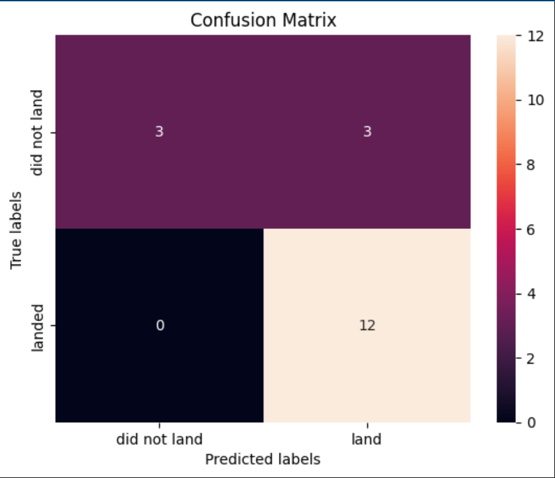

## Project Pipeline

```
Data Collection (API) → Web Scraping → Data Wrangling
             ↓
EDA with SQL → EDA with Visualization → Interactive Maps
             ↓
      Machine Learning Prediction
```

## Notebooks

| # | Notebook | Description | Tools |
|---|----------|-------------|-------|
| 1 | [Data Collection — API](notebooks/01_data_collection_api.ipynb) | Collect SpaceX launch data via REST API | Requests, Pandas |
| 2 | [Web Scraping](notebooks/02_web_scraping.ipynb) | Scrape launch records from Wikipedia | BeautifulSoup, Pandas |
| 3 | [Data Wrangling](notebooks/03_data_wrangling.ipynb) | Clean, encode, and prepare data for analysis | Pandas, NumPy |
| 4 | [EDA — SQL](notebooks/04_eda_sql.ipynb) | Explore data using SQL queries | SQLAlchemy, SQLite |
| 5 | [EDA — Visualization](notebooks/05_eda_visualization.ipynb) | Visual patterns and correlations | Matplotlib, Seaborn, Plotly |
| 6 | [Interactive Maps](notebooks/06_interactive_maps.ipynb) | Geospatial analysis of launch sites | Folium |
| 7 | [Machine Learning](notebooks/07_machine_learning.ipynb) | Train and evaluate 4 classification models | Scikit-learn, GridSearchCV |

## Dashboard

An interactive **Plotly Dash** dashboard to explore SpaceX launch records:

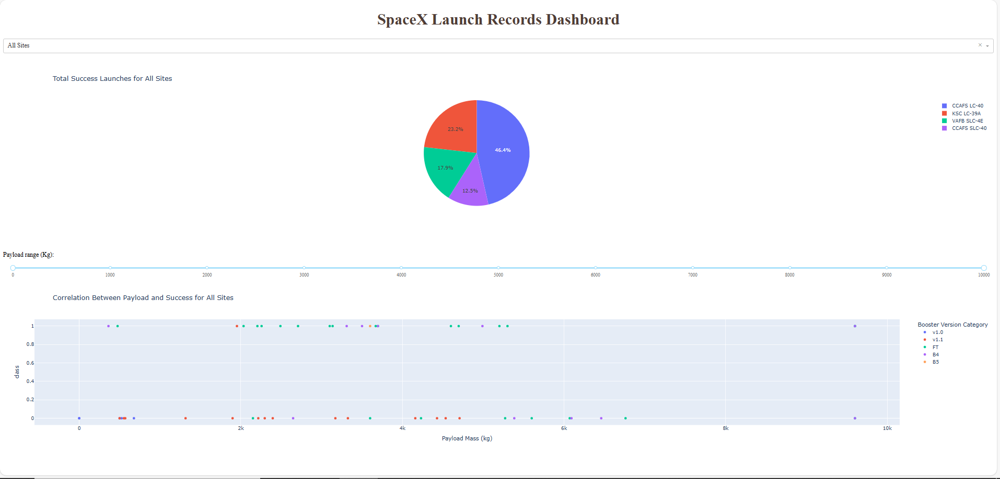

| | |
|---|---|
| 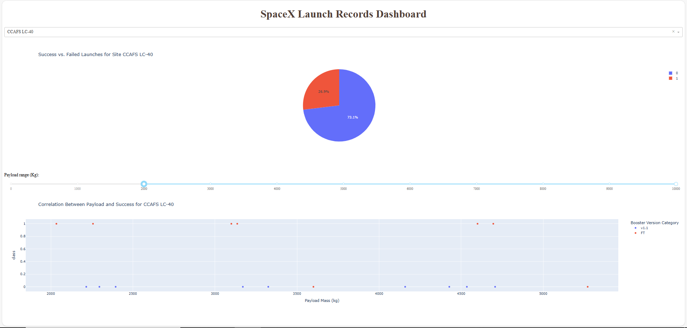 | 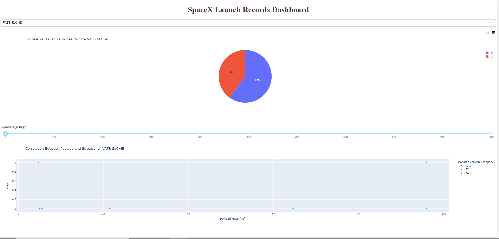 |
| 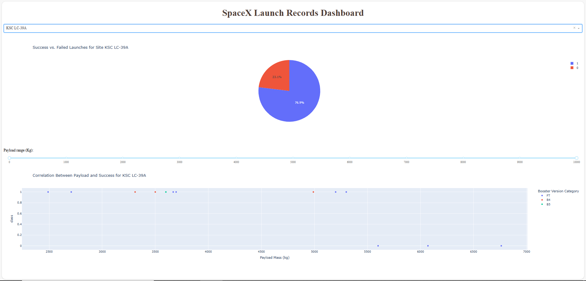 | 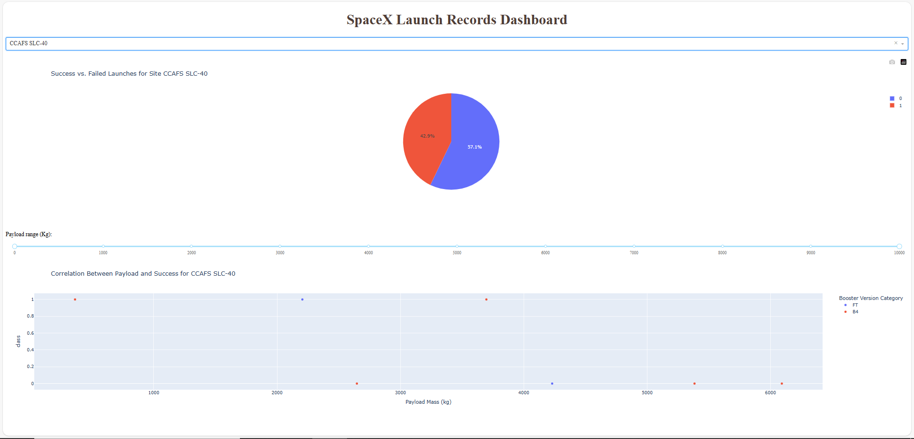 |

**Features:**
- Filter launches by site (All Sites / CCAFS LC-40 / VAFB SLC-4E / KSC LC-39A / CCAFS SLC-40)
- Pie chart of success rates per site
- Scatter plot of payload mass vs. launch outcome by booster version

**Run locally:**
```bash
cd app
python spacex_dash_app.py
# Open http://127.0.0.1:8050
```

## Exploratory Data Analysis

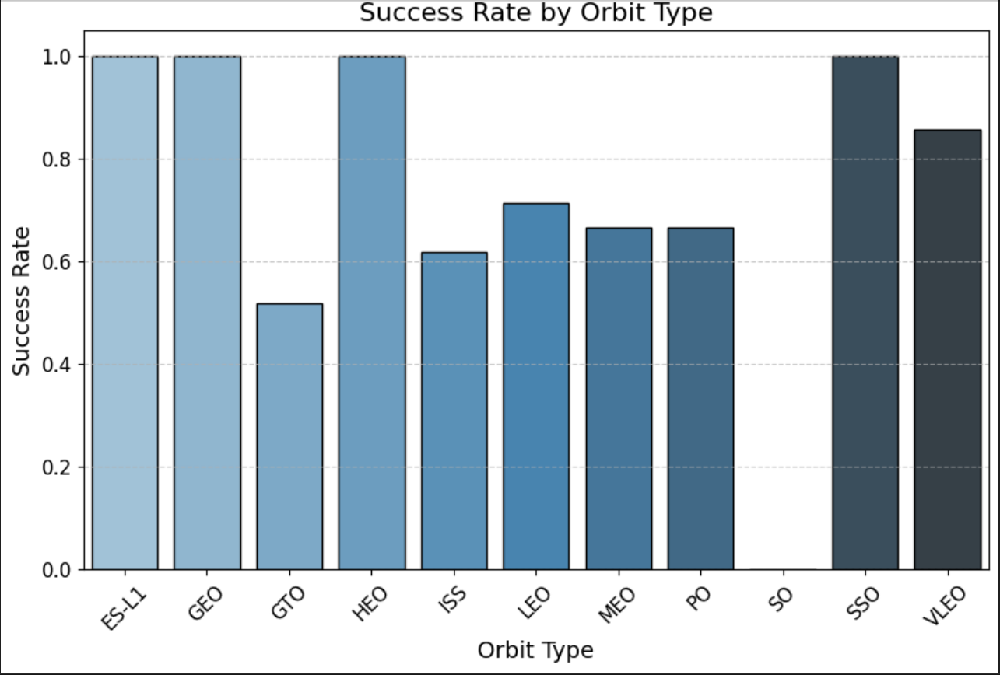
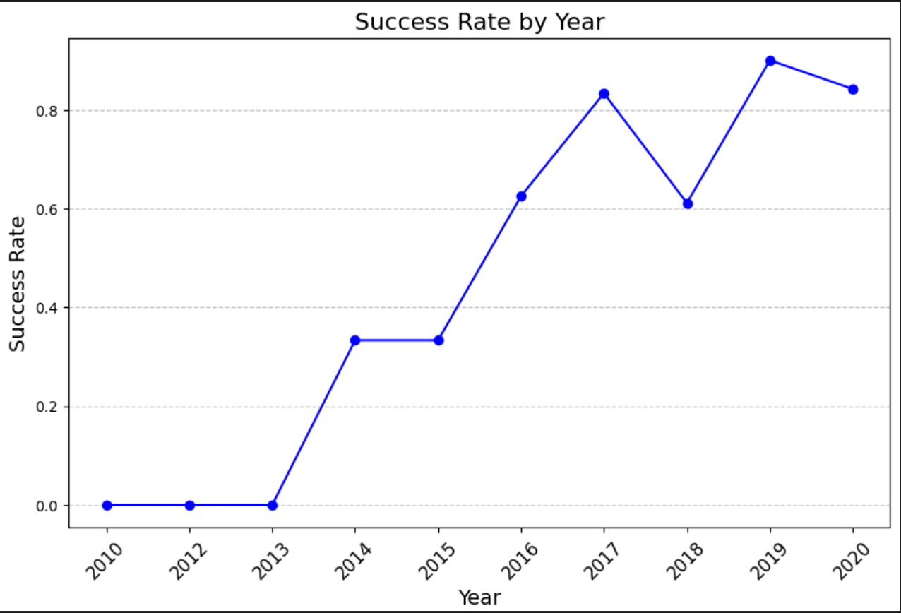

## Launch Site Geospatial Analysis

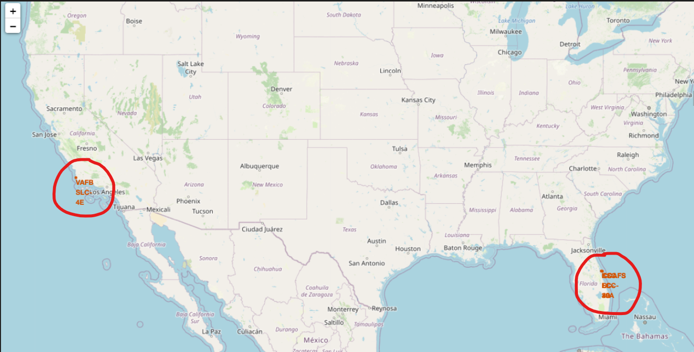

| | |
|---|---|
| 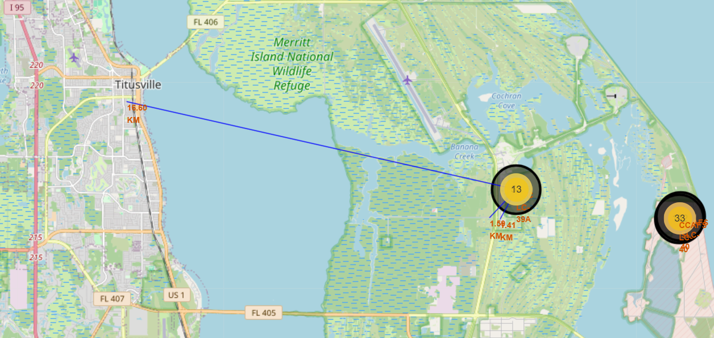 | 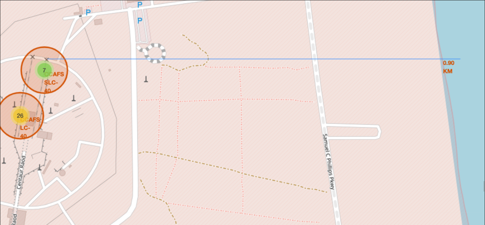 |

## Technologies

| Category | Tools |
|----------|-------|
| Data Processing | Python, Pandas, NumPy |
| Visualization | Matplotlib, Seaborn, Plotly |
| Machine Learning | Scikit-learn (LR, SVM, DT, KNN, GridSearchCV) |
| Interactive Analytics | Dash, Folium |
| Data Collection | Requests, BeautifulSoup, SQLAlchemy |

## Installation

```bash
# 1. Clone the repository
git clone https://github.com/Boypop/IBM-DataScience-Capstone-Project.git
cd IBM-DataScience-Capstone-Project

# 2. Install dependencies
pip install -r requirements.txt

# 3. Launch Jupyter
jupyter notebook
# Open any notebook from the notebooks/ folder
```

## Project Structure

```
IBM-DataScience-Capstone-Project/
├── notebooks/          # 7 Jupyter notebooks (full pipeline)
├── app/                # Interactive Dash dashboard
├── data/               # SpaceX datasets (CSV)
├── presentation/       # Final capstone presentation
├── assets/             # Screenshots and visuals
├── requirements.txt
└── README.md
```

## Certificate

This project is the capstone of the [IBM Data Science Professional Certificate](https://www.coursera.org/professional-certificates/ibm-data-science) on Coursera — a 10-course program covering data science fundamentals, Python, SQL, data visualization, machine learning, and more.

## License

This project is licensed under the [MIT License](LICENSE).
